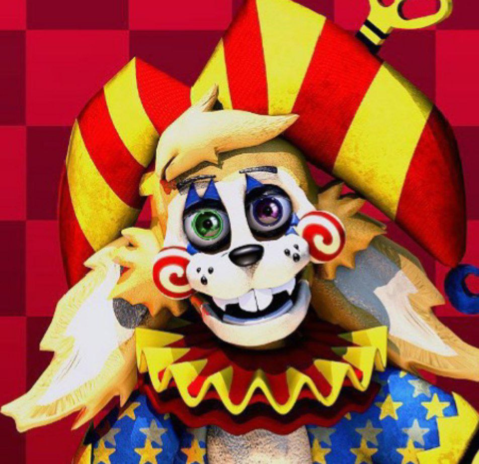

<svg width="200" height="200" viewBox="0 0 200 200" xmlns="http://www.w3.org/2000/svg">
  <defs>
    <clipPath id="circleView">
      <circle cx="100" cy="100" r="100" />
    </clipPath>
  </defs>
  
</svg>

# 🎨 2D Artist & Designer

 

### 👋 Обо мне
Я обычный 2D-художник и дизайнер, увлеченный созданием визуальных миров.
В данный момент я являюсь частью команды глобального проекта:
 
🎮 [FNaF's: Universe & Fanverse (Minecraft Mod)](#)

 

---

### 🚀 Чем я занимаюсь?
##💻 Программирование

    
    

### 📫 Связаться со мной

 
 

